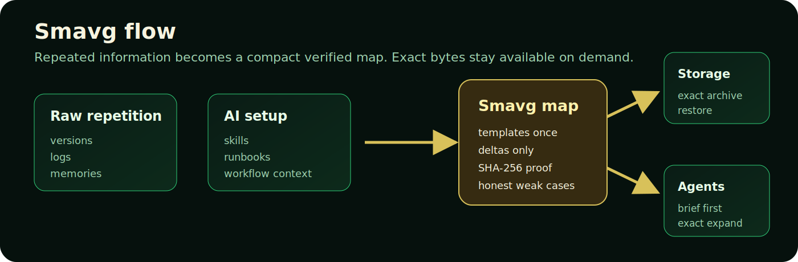
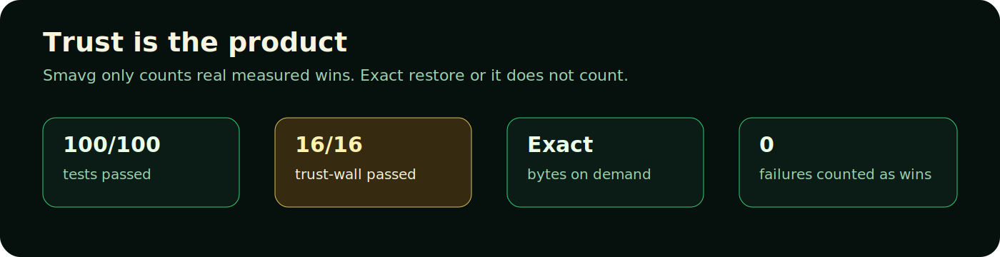

<p align="center">
  <a href="TRUST.md">100 tests</a> ·
  <a href="SAFETY.md">local-first</a> ·
  <a href="FORMAT.md">exact restore</a> ·
  <a href="BENCHMARKS.md">real benchmarks</a> ·
  <a href="LICENSE">Genesis license</a>
</p>

# Smavg 🐲

**Smavg 🐲 reduces up to x1364 times your disk space, saves tokens and restores exact files.**

**Smavg 🐲 is Local first repetition firewall for data and AI agents.**

ℹ Smavg 🐲 finds repeated information, stores the repeating part once, and keeps exact files available when you need them.

No cloud. No API keys. No fake results. Exact restore or it does not count.

## Start Here

If you only remember one thing:

```text
Smavg removes repeated baggage before it wastes disk space or AI context.
```

What you do first:

```bash
smavg scan
smavg report
smavg status
```

What Smavg does:

- scans locally
- tells you where repetition exists
- shows savings in simple `x` numbers
- keeps exact files available
- refuses to count failed verification as success

What Smavg does not do:

- does not upload your files
- does not delete your files automatically
- does not ask AI to recreate exact files
- does not pretend every folder will shrink

New users should read [START_HERE.md](START_HERE.md), then
[QUICKSTART.md](QUICKSTART.md).

## What Smavg Is

Smavg has one product focus:

```text
Remove repetition safely, then retrieve exact information on demand.
```

That focus appears in two places:

- Save disk space when files repeat the same structure.
- Save AI context tokens when agents keep rereading the same setup, memories,
  skills, runbooks, histories, and reports.

The simple idea:

```text
Scan locally -> find repetition -> make a compact map -> exact-expand only when needed.
```

<p align="center">
  
</p>

For storage, Smavg creates `.smavg` archives that restore original bytes.

For AI agents, Smavg creates compact context briefs so the agent reads the map
first, then asks for exact files only when needed.

## The Problem

Computers store repeated information again and again.

AI agents also reread repeated information again and again.

That wastes:

- disk space
- AI context window
- token budget
- time
- attention
- session limits

Smavg removes repeated baggage while keeping exact retrieval available.

## The Safety Promise

Smavg is built around trust rules:

- `smavg scan` is read-only.
- `smavg report` is read-only.
- `smavg status` is read-only.
- `smavg apply` verifies before cleanup.
- Smavg does not delete user data automatically.
- Quarantine is not deletion.
- Exact files are retrieved from real bytes, not regenerated by AI.
- Failed verification events are not counted as wins.
- Weak folders are reported honestly.

## Quick Start

From a downloaded zip:

```bash
unzip smavg.zip
cd smavg
python3 -m pip install -e .
smavg scan
smavg report
smavg status
```

From a GitHub checkout:

```bash
git clone https://github.com/aegiswizard/smavg.git
cd smavg
python3 -m pip install -e .
smavg scan
smavg report
smavg status
```

To safely archive a folder:

```bash
smavg apply ./my-folder --out my-folder.smavg
```

To create an AI context brief:

```bash
smavg context ./my-folder --out context.md --json context.json
```

To retrieve an exact file from that brief:

```bash
smavg expand-context context.json path/in/folder.txt --out restored.txt
```

Install details are in [INSTALL.md](INSTALL.md).

## Main Commands

| Command | Purpose | Safe by default |
|---|---|---|
| `smavg scan` | Find folders where Smavg may help | Yes |
| `smavg report` | Show latest simple report | Yes |
| `smavg status` | Show saved today, all-time, and trust totals | Yes |
| `smavg apply` | Safely pack a folder after verification | Yes |
| `smavg context` | Build an AI-readable repetition map | Yes |
| `smavg expand-context` | Retrieve one exact file from a context map | Yes |
| `smavg gate` | Build a task packet for an AI agent | Yes |
| `smavg work` | Run a Smavg-assisted task with receipt and ledger | Yes |
| `smavg ledger` | Show token/disk savings over time | Yes |
| `smavg daemon` | Run quiet local scan/report cycles | Yes |
| `smavg plugin` | Build/verify agent integration bundle | Yes |
| `smavg mcp-server` | Expose Smavg to MCP-compatible agents | Yes |

## Example Results

These are real measured local results from the included reports.

Token numbers are Smavg-visible estimates. Storage numbers are real measured
bytes.

| Area | Before | After | Result |
|---|---:|---:|---:|
| Versioned code history | 171,156,036 bytes | 277,293 bytes | 617.239x |
| Mixed history corpus | 46,885,286 bytes | 164,556 bytes | 284.920x |
| Kimi MCP packages context | 6,394,079 tokens | 4,685 tokens | 1364.798x |
| Codex memories context | 203,506 tokens | 1,595 tokens | 127.590x |
| Strict gate repeated work | 9,943,296 tokens | 140,736 tokens | 70.652x |
| X workflow setup | 71,844 tokens | 4,121 tokens | 17.434x |
| Surface registry brief | 970,368 tokens | 30,953 tokens | 31.350x |

The public benchmark index is in [BENCHMARKS.md](BENCHMARKS.md).

## Smavg For AI Agents

Smavg gives agents a better working pattern:

```text
Map first.
Exact expand second.
Verify always.
Never regenerate exact file contents with AI.
Record the X reduction honestly.
```

This helps agents avoid rereading the same setup on every task.

Smavg currently supports:

- local skill instructions
- MCP server tools
- plugin bundle generation
- workflow context
- task receipts
- exact expansion
- lifetime ledger

See [AGENT_MANUAL.md](AGENT_MANUAL.md), [SKILL.md](SKILL.md), [MCP.md](MCP.md),
and [PLUGIN.md](PLUGIN.md).

## Smavg For Storage

Smavg stores repeated/versioned data using a planner.

The planner can choose:

- history packs for repeated versions
- template codecs for structured files
- full safe fallback when no better structure is found
- exact restore checks before counting success

The `.smavg` format is documented in [FORMAT.md](FORMAT.md).

## Supported Data

Smavg is strongest on:

- versioned code
- repeated notes
- AI memories
- skills and runbooks
- logs
- repeated reports
- JSON/CSV/text folders
- repeated workflow setup

Smavg still works safely on weak folders, but it says so honestly.

## Trust

Current local trust result:

```text
100/100 tests passed.
16/16 trust-wall tests passed.
Failures counted as wins: 0.
Deletes performed by Smavg: 0.
```

<p align="center">
  
</p>

Trust docs:

- [TRUST.md](TRUST.md)
- [SAFETY.md](SAFETY.md)
- [benchmarks/2026-05-20-trust-wall-v1.md](benchmarks/2026-05-20-trust-wall-v1.md)

## Repo Map

```text
src/smavg/       core implementation
tests/           100-test suite
benchmarks/      public measured reports
examples/        small learning examples
skills/          reusable Smavg skill
mcp/             MCP config example
plugin/          plugin bundle example
scripts/         release helper scripts
```

Important docs:

- [START_HERE.md](START_HERE.md): simplest explanation and first run.
- [INSTALL.md](INSTALL.md): install from zip or GitHub.
- [QUICKSTART.md](QUICKSTART.md): safe first commands.
- [USER_MANUAL.md](USER_MANUAL.md): ordinary-user guide.
- [AGENT_MANUAL.md](AGENT_MANUAL.md): how AI agents should use Smavg.
- [RELEASE_CHECKLIST.md](RELEASE_CHECKLIST.md): public launch checklist.

## License

Smavg uses the Smavg Modified MIT License, Version Genesis 1.0 2026.

Read:

- [LICENSE](LICENSE)
- [LICENSE_SUMMARY.md](LICENSE_SUMMARY.md)
- [NOTICE](NOTICE)
- [ATTRIBUTION.md](ATTRIBUTION.md)
- [COMMERCIAL.md](COMMERCIAL.md)
- [LEGAL_NOTES.md](LEGAL_NOTES.md)
- [CONTRIBUTOR_TERMS.md](CONTRIBUTOR_TERMS.md)
- [TRADEMARK.md](TRADEMARK.md)
